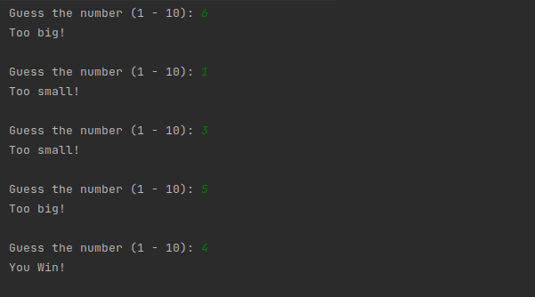
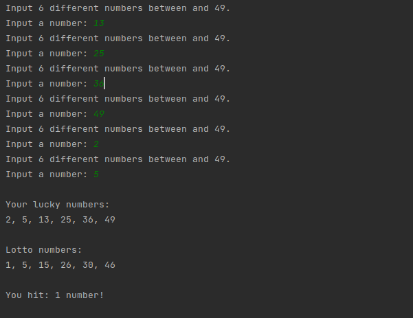
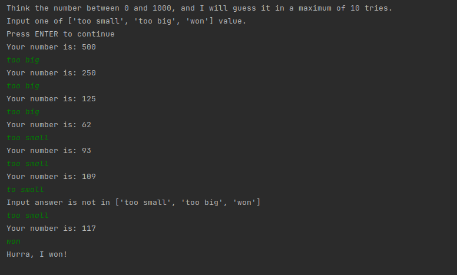
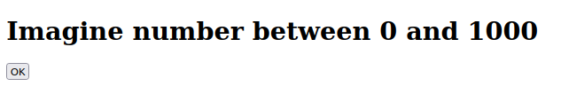
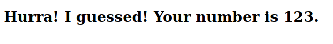
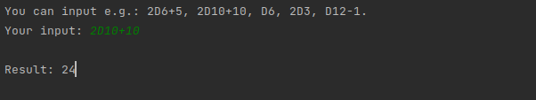
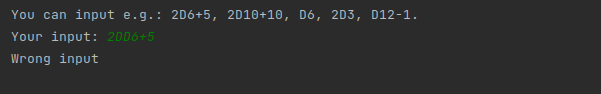
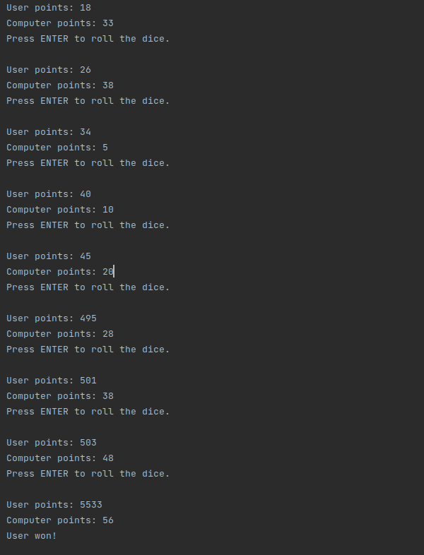

# Games Room
Simple games written in Python.

## Table of Contents
* [General info](#general-info)
* [Technologies Used](#technologies-used)
* [Features](#features)
* [Screenshots](#screenshots)
* [Setup](#setup)
* [Usage](#usage)
* [Project Status](#project-status)

## General info
This project was made to write some games in Python. Program will contact the user mainly via the terminal.
For some tasks, Flask framework was used.

## Technologies Used
Project is created with:
* Python version: 3.6.9
* Flask version: 2.0.2

## Features
Games you can play:
* `1_Guess-the-number_v1` - Guess the number drawn by computer (1 - 10).
* `2_Lotto-simulator` - Lotto game simulation. As you know, this is a game that draws 6 numbers from 1 to 49.
The player's task is to correctly select the randomly selected numbers. 
* `3_Guess-the-number_v2` - Think the number (1 - 1000) and computer will guess it in a maximum of 10 tries. Your task
will be to answer: too small, to big or won.
* `4_Guess-the-number_v3` - The same as above, but in a web application using the Flask framework. You get a form with
three buttons: too small, too big and won.
* `5_Roll-the-dice` - In RPG games, many types of dices are used. The most popular is 6-sided dice. Writing, for
example, 'roll two 12-sided dice and add 8 to score' means: 2D12+8. 
To calculate dice roll from dice pattern:  
    xDy + z  
    x - number of dice rolls (if you throw once - its negligible)  
    y - type of dice to use (e.g. D6)  
    z - number to add/subtract to the result of dice rolls  
* `5_Roll-the-dice_regex` - same as above, using regex.
* `6_2001` - Get the 2001 points. Its two-player version game (you and computer). Each player starts with 0 points.
On ones turn, the player rolls 2 dices (standard six-sided dice). The number of spots thrown is added to the total
number of points.  
Starting from the second round:  
-- if player rolls 7 - number of points are divided by that value  
-- if player rolls 11 - the current number of points  are multiplied by 11  
The first player to score 2001 points wins.

## Screenshots

### Guess-the-number_v1:

### Lotto-simulator:

### Guess-the-number_v2:

### Guess-the-number_v3:

### Roll-the-dice and Roll-the-dice_regex:

### 2001:

## Setup
* Fork the repository and run the file that interest you by clicking `Run`.
* To run games using Flask framework: `pip install flask`

## Usage
* After you clone this repo to your desktop, go to its root directory, choose the file that interest you and `Run` it.  
* To run development server, click `Run`. You  will be able to access it at `http://127.0.0.1:5000/`

## Project Status
Project is _complete_.
